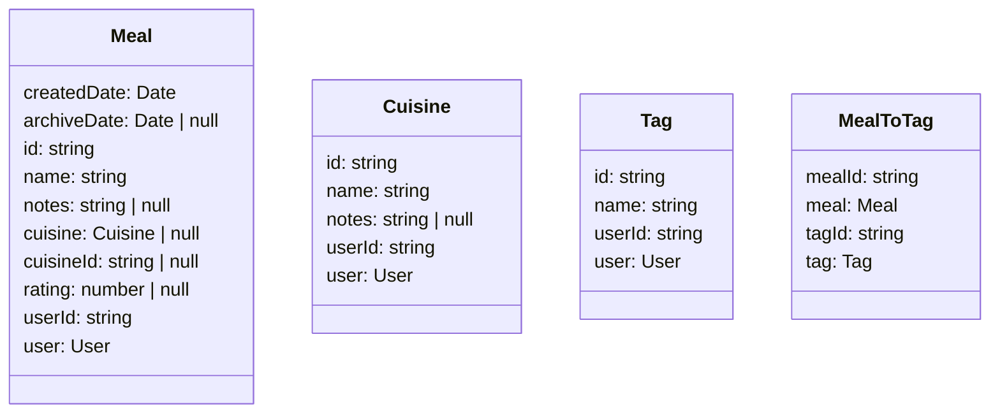
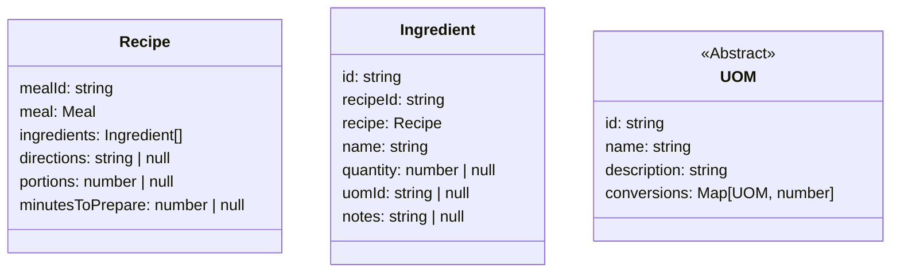
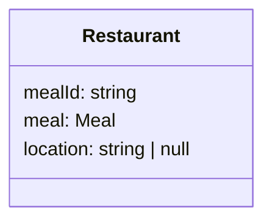

# Meals

- [Meals](#meals)
  - [Layout](#layout)
  - [Meal](#meal)
    - [Recipe](#recipe)
    - [Restaurant](#restaurant)

this page is where you manage meals which should populate in the planner

## Layout

a tabbed layout

with a fixed width side menu with actions that relate to the selected tab

- create
- import
- export

inside the tab a simple table containing each associated item

actions should go along with each item

- edit
- archive
- restore
- delete

## Meal

there is a base entity, meal, and multiple types have one-one's with that meal

`Meal -> Recipe`

`Meal -> Restaurant`

### Recipe

### Restaurant

